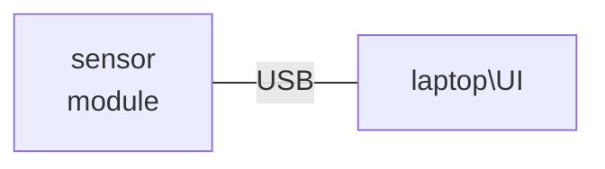

# Setup Guide

This documentation is intended to help user have an overview of the setup and how its modules functions. For more details about the hardware used, see the [hardware reference](./hardwareReference.md).

> :exclamation: A step file for example to view a detailed 3D model of NoSeMaze is provided in [HardwareDocumentaion](../HardwareDocumentation/)

*__Fig. 1:__ NoSeMaze 3D model from step file*

Figure 1 shows a preview of the 3D model of a NoSeMaze from the step file provided in HardawareDocumentation folder, indexed with where the system could be placed.

The box where the animals are placed is separated into two areas. The food and nest area contains nesting material and food container. The free area is annexed with a olfactometer test area.

The test area is long narrow corridor with the lick port at the end of the corridor, so that only one animal can reach the end of the corridor at a time.

The upper cabinet is used to place the olfactometer system, except the final valve, the lick sensor and the reward system which are placed in olfactometer test area due to their functionalities.

The lower cabinet is used to place the computer system in exception of the monitor which is placed in olfactometer test area and the keyboard and mouse which are placed in the olfactometer area due to their functionalities.

## Automatic Olfactometer System

*__Fig. 2:__ Overview of Automatic Olfactometer*

The automatic olfactometer system consists of:

1. an NI board,
2. an olfactometer,
3. tubing for olfactometer,
4. one or two lick sensors,
5. a light barrier sensor,
6. one or two water containers,
7. one or two water valves,
8. flexible tubing for water container system, and
9. a computer.

The NoSeMazeControl UI receives sensor signals from NI board and sends instructions to the NI board. Sensor signals that are sent from the NI board are from light barrier sensor and lick sensors which are connected to the analog input of the NI board using BNC cable. The NI board controls the olfactometer and the water valve using digital outputs from on or more digital ports in the NI board.

### Olfactometer

The olfactometer is a group of valves which are controlled using digital outputs from NI Board.

*__Fig. 3:__ Air Flow of Olfactometer*

As shown in figure 3, pairs of normally closed flush valves (V0, V1, V2) are connected through their "flush" air way connection. A pair of normally opened flush valves are also connected at the end through their "flush" air way, but thereafter one of the "flush" air way vent is closed and the other is connected to the final valve. Air flow 1 is 1 L/min and air flow 2 is 0.1 L/min.

*__Fig. 4:__ Wiring of Olfactometer*

Figure 4 shows how the wiring is connected. Each valves needs a driver board which read the TTL signal and drive the valves. The drivers D0 until D7 are driving the valve pairs V0, V1, V2 and V7. These drivers are connected to digital output channel 0, 1, 2, and 7 at port 0 of NI board. The final valve driver D8 is connected to digital output channel 0 at port 2 of NI board.

### Lick Port

*__Fig. 5:__ Overview of Lick Port*

Figure 5 shows a schematic of a lick port. __a__ indicates where the tube from olfactometer goes in. __b__ indicates where the RFID antenna is. __c__ indicates where the light barrier sensor is. __d__ indicates a box where the nozzle for reward system would be placed. The animal would be presented the odor from the olfactometer as the light barrier is triggered and given the odor according to its RFID tag. Then, the animal would be rewarded through the nozzle according to the planned schedule. The light barrier sensor is connected to analog input 0 of the NI board.

*__Fig. 6:__ Wiring of Lick Sensors and Water Valves*

In figure 6 is shown the wiring of the lick sensors. The lick sensor is a darlington sensor. The plus electrode is connected to the nozzle and the negative electrode is connected to the ground plate where the animal would be sitting on while doing the trial. Both the ground plate and the nozzle must be an inductor. The sensors then sends a signal back to analog input of the NI board via BNC cable.

### Water Container with Control Valve

Figure 6 shows also the wiring of the water valves. Reward container, indicates in the figure as water container, would be placed higher than the nozzle so the fluid will flow down to the nozzle. The flow is controlled by water valve WV1 and WV2, which are simple open-close control valves. If there is no trial, WV1 and WV2 close and stop
the flow. If a trial should be rewarded, WV1 and WV2 open for a duration according to how much the reward should be given.

## Tube Test System

*__Fig. 7:__ Overview of Tube Test System*

The tube test consists of:

1. The tubes connecting two areas in the box which are separated with a wall as shown in figure 7, and also
2. RFID readers placed at both entrances/exits of the tubes.

The RFID antennae are placed like shown in figure 7. Then, the anntennae are connected to their RFID decoder respectively. Here we use 4 RFID decoder for each antenna which are daisy chained using RS485 protocoll. The end of the daisy chain is RFID decoder 4 and the start of the chain is RFID decoder 1. Then RFID decoder is connected to an RS485/USB adapter, which itself is connected to the computer via USB. A separate UI from the rfid decoder vendors was provided to record all timestamps and RFID tag read from the antenna.

## Environment Sensor Module

The environment sensor module is placed above on a side wall feeding and nesting area (name of areas as indicated in figure 7). The module is connected via USB to a laptop which runs the UI provided from Fraunhofer Institute to records the data.

## Video Cameras for Analysis with Video Tracking

Two cameras are mounted at the top of the feeding and nesting area and the free area, so that the camera records a top down view of both areas.
