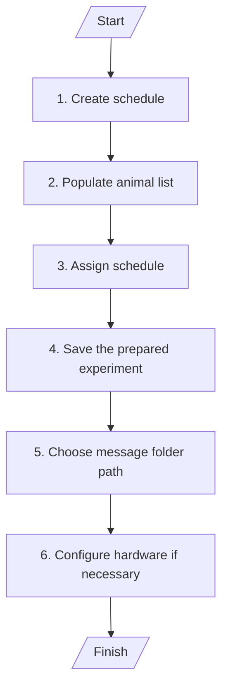
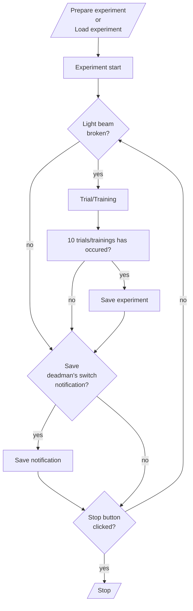

# User Guide

This documentation is meant to help user navigate the [_NoSeMazeControl_](#nosemazecontrol) UI and [_NoSeMazeSchedule_](#nosemazeschedule) UI and part of NoSemaze documentation.

## NoSeMazeControl

- [Introduction](#introduction-nsc)
- [Starting The UI](#starting-nsc)
- [Starting An Experiment](#starting-an-experiment)
- [UI Descriptions](#ui-nsc)
  - [Main Window](#nsc-main-window)
  - [Hardware Preference Window](#nsc-hardware-preference-window)
  - [Animals Window](#nsc-animals-window)
  - [Analysis Window](#nsc-analysis-window)
  - [Video Control Window](#nsc-video-control-window)
- [Experiment Flowchart](#experiment-flowchart)

### Introduction {#introduction-nsc}

The NoSeMazeControl serves as a central control for the user to:

- start and stop experiment session,
- save and load experiment,
- view some performance result,
- and also configure the hardware interface.

The trials/trainings executed during the experiment are determined by the schedules assigned to each animal.

### Starting The UI {#starting-nsc}

To start the UI, run [_main.py_](../../NoSeMazeControl/main.py) from the [_NoSeMazeControl_](../../NoSeMazeControl/) folder using python version 3.10 or above.

> :exclamation: **Important** :  
> The UI is dependent on niDAQmx as it communicates with the NI Board using niDAQmx library. Make sure to install it before starting the UI.

### Preparation Before Starting An Experiment {#preparation}

To start an experiment, there are several things that must be done first. If there is already a saved experiment (a file with _.nosemaze_ suffix), this section can be skipped (continue to **[Starting&nbsp;The&nbsp;Experiment](#starting-the-experiment)**).

1. **Create Schedule**
    Before starting the experiment, create the trials/training schedule necessary for the experiment using the NoSeMazeSchedule UI. For more details on how to create a schedule, see [NoSeMazeSchedule guide](#nosemazeschedule).
     

2. **Populating animal List**
    The animal list must be populated with the RFID tag of the animals before starting the experiment. Populating animal list is done in the animal window.

    > :exclamation: **Important** : There will be a _'default'_ animal available in the animal list. The _'default'_ animal will be used as a fallback dummy animal, if the rfid tag of an animal can not be read successfully.
    >
    > Assign a schedule also for the _'default'_ animal e.g. a simple water reward to ensure that the animal still get water as the lick port is designed as the only water source in the experiment setup. For more details about the setup, see the [setup guide](setupGuide.md).

    Step by step instruction:

    1. Click _animal list_ in _Animals_ menu in the menu bar to open the animal window.
    2. There will be a _'default'_ animal available in the animal list (Number 1 on [Fig. 3](#animals-window-nsc-animals-window)). To add an animal, click the _add_ button (plus button in number 2 on [Fig. 3](#animals-window-nsc-animals-window)). A new row will be added in the table.
    3. Double click the cell of the new row and write the RFID tag of the animal. After that click outside of the cell to exit cell editing.
       > :memo: **Hint** : the written RFID will not yet be registered in the table before the cursor exit cell editing.
    4. Update the animal table by clicking _update list_ &rarr; _confirm_. Only saved animal RFID in the table can be assigned schedules.
     

3. **Assigning Schedule**
    After populating the table, assign the schedule for each animal.

    Step by step instruction:

    1. Click on an animal in the animal list, then click _add schedule_ button. An open file dialogue window will be opened.
    2. Choose the schedule and open it. The schedule will be added to the animal and diplayed in the middle table viewer (number 3 of [Fig. 3](#animals-window-nsc-animals-window))
     

4. **Saving the experiment session**
    After populating the animal list with the animals and its respectives schedules, save the experiment.

    Step by step instruction:

    1. Click _File_ in the menu.
    2. Then click _save experiment_. A file save dialogue window will be opened.
    3. Save the experiment.
     

5. **Choose notification folder path**
    There will be messages that are saved in the notification folder path, e.g. a deadman's switch notification or software crash notification.

    > :memo: **Tip** : Choosing a cloud/synchronised folder as message folder will enable the user to monitor the experiment setup from remote workplace.

    Step by step instruction:
    1. To define the folder path, click _Notification_ &rarr; _Message Folder_. An file dialog window will be opened.
    2. Choose the folder which the messages should be written in.
     

6. **Configure the hardware preferences** (optional)
    There might be some configuration that need to be done, such as, which analog input channel of the NI board used to detect licks. For more information, see **[Hardware&nbsp;Preference&nbsp;Window](#hardware-preference-window-nsc-hardware-preference-window)** in **[UI&nbsp;Description](#ui-descriptions-ui-nsc)**

### Starting The Experiment

After the aforementioned preparation is done, click the start button on the control panel (numbered 1 on [Fig. 1](#main-window-nsc-main-window)) to start the experiment. A deadman's switch notification will be saved; first at start, then at 8:00, at 17:00 and at 22:00. See **[Notification](#notification)** section for more information.

### Saving The Experiment

The experiment will be saved automatically after each 10 trials done by any animals. Saving the experiment can also be done manually by clicking **File**&nbsp;&rarr;&nbsp;**Save experiment** at any point of the experiment.

### Stopping The Experiment

To stop the experiment, click the **Stop** button in the **control panel** (numbered 1 on [Fig. 1](#main-window-nsc-main-window)).

### UI Descriptions {#ui-nsc}

#### Main Window {#nsc-main-window}

_**Fig. 1:** Main Window of NoSeMazeControl UI._

##### File {#mw}

##### Hardware

##### Animals

##### Analysis

##### Notification

##### Video

##### Help {#nsc}

##### Control Panel (1)

##### Experiment Info (2)

##### Results Table (3)

##### Odor Data and Licks Data/Analog Inputs (4)

#### Hardware Preference Window {#nsc-hardware-preference-window}

_**Fig. 2:** Hardware Preference Window of NoSeMazeControl UI._

##### File {#hpw}

##### Hardware Preferences Parameters [1]

##### Number of Channels [2]

##### NI USB 6216 Check Box [3]

#### Animals Window {#nsc-animals-window}

_**Fig. 3:** Animals Window of NoSeMazeControl UI._

##### Update List

##### Animal List [1] {#aniw-animal-list}

##### Add and Remove Button [2]

##### Schedule Table [3]

##### Trial Parameter Table [4]

#### Analysis Window {#nsc-analysis-window}

_**Fig. 4:** Analysis Window of NoSeMazeControl UI._

##### Animal List [1] {#anaw-animal-list}

##### Bin Size [2]

##### Performance Curve [3]

#### Video Control Window {#nsc-video-control-window}

_**Fig. 5:** Hardware Preference Window of NoSeMazeControl UI._

##### Setting

##### Animal List [1] {#vcw-animal-list}

##### Performance Curve [2]

##### Camera 1 Feedback [3]

##### Camera 2 Feedback [4]

### Experiment Process

This section provides flowcharts of processes in an experiment including the preparation of an experiment.

#### Preparation Flowchart

_**Fig. 6:** Preparation before the experiment._

#### Experiment Flowchart

_**Fig. 7:** Experiment flow from before starting an experiment to the end of an experiment._

### Known Issues {#nsc}

1. Closing the main window before stopping the experiment might cause the main window to hang for some time due to main window exterminating the experiment thread in a _"close"_ event.

## NoSeMazeSchedule

- [Introduction](#introduction-nss)
- [Starting The UI](#starting-nss)
- [Creating A Scheudule](#creating-a-schedule)
- [UI Descriptions](#nss-ui-descriptions)
  - [Main Window](#nss-main-window)

### Introduction {#introduction-nss}

The NoSeMazeSchedule serves as a tool to build schedules which are used in NoSeMazeControl. The schedules are made from a custom made widget. Developer can also build their custom widget e.g. with custom parameters for a custom trial as the widget build has a specific trial/training in mind. Please make sure to implement the trial/training also in NoSeMazeControl [ExperimentControl.py](../../NoSeMazeControl/Controllers/ExperimentControl.py) and [DAQ.py](../../NoSeMazeControl/daqface/DAQ.py).

### Starting The UI {#starting-nss}

To start the UI, run [scheduleMain.py](../../NoSeMazeSchedule/scheduleMain.py) from the [_NoSeMazeSchedule_](../../NoSeMazeSchedule/) folder using python version 3.10 or above.

### Creating A Schedule

Steps to create a schedule:

1. Set number of valves in valve valence map. Valve valence map is numbered 1 in [Fig. 9](#main-window-nss-main-window)).

2. Choose which odor index will associated with which valve in valve valence map. To see more information about how to associate odour index with which valves, see **[Valve Valence Map](#valve-valence-map-1)** in **[UI Descriptions](#ui-descriptions-ui-nss)**.

3. Choose a schedule widget in schedule widget combo box (numbered 2 in [Fig. 9](#main-window-nss-main-window))

4. Set the schedule parameters in the schedule widget. For more information of the parameters, see **[Schedule&nbsp;Widget](#schedule-widget-3)**.

5. Click the **Generate** button. The generated schedule will be viewed on the **Trials Table** (numbered 4 in [Fig. 9](#main-window-nss-main-window)).

6. After checking if the schedule is correctly generated, save the schedule by clicking **File**&nbsp;&rarr;&nbsp;**Save**.

### NoSeMazeScheduleWidget

_**Fig. 8:** NoSeMazeScheduleWidget_

NoSeMazeScheduleWidget is a schedule widget which generates a GNG trials schedule for 2 lick ports. It can also be used to generate trials for 1 lick port as the reward given to left and right ports are defined separately, e.g. only rewarding left port or only rewarding right port for 1 port compatibility.

The parameters in this widget are:

1. Number of Trials
    : Number of trials should be generated in the schedule. Input is an integer number.

2. Odour Duration [s]
    : The duration that the odour should be presented in a trial. Input is a float number in seconds.

3. Pretraining
    : Schedule mode for pretraining. The animal will not be presented an odour and water will be given immediately through the lick port as soon as the light beam by the port is broken. To use this mode, check the radio checkbox.

    >For information about the lick port and the setup, see [setup guide](./setupGuide.md) or [hardware reference](../HardwareDocumentation/README.md).

4. Odour Training
    : Schedule mode for odour training. The animal will be presented an odour and will be given reward or a timeout according to the reward map. To use this mode, check the radio checkbox.

    >To uncheck both radio checkboxes reload the schedule widget by opening the schedule widget combo box (number 2 in [Fig. 9](#main-window-nss-main-window)) and selecting the widget again.
    :exclamation: Note that all parameters will also be reloaded to default value :exclamation:

5. Trial Onset [s]
    : The onset duration before all other trial processes in seconds. For most purposes, it can be left as default value, which is 0.1 second or 0 second.

6. Trial Offset [s]
    : The offset duration after all trial processes in seconds. For most purposes, it can be left as default value, which is 0.1 second or 0 second.

7. Lick Fraction
    : The value, above which the ratio of the duration the animal has licked to the duration the animal hasn't licked in a lick window is considered as responded. In the current implementation the trial, a trial will be considered responded when the animal has licked longer than `[the lick fraction] * [the duration of the lick window]` or the animal has licked more than twice.

    >E.g. Assumed that the lick window is 2 seconds and the lick fraction is 0.1, then the animal must licked longer than 0.2 seconds or licked the port more than twice, so that the trial is considered as 'responded'.

8. Number of Odours
    : The number of odours used in the trial. This defines the number of the odour index used in the schedule.

9. Reward Map
    : A table that maps which odour index is rewarded with which amount.
    The _**columns of the table**_ represent the odour index (column 1 is odour index 1, column 2 is odour index 2, etc.).
    The _**reward probability**_ defines the probability that the odour will be rewarded. Input is a floating number between 0 to 1.
    The _**amount of reward**_ defines the duration that the water vent will opened. Input is a floating number in seconds.
    The _**delay**_ defines the duration of a delay between an odour presentation to a lick window. Setting this to 0 means that the odour duration is the lick window. Else the lick window is equal to `[odour duration] - [delay]`. For most purposes, it can be left as 0.

#### Reward Map Examples

##### 1. Creating Schedule for one port

##### 2. Creating Schedule for two ports

### UI Descriptions {#ui-nss}

#### Main Window {#nss-main-window}

_**Fig. 9:** Main window of schedule generator UI._

##### File {#nss}

##### Help {#nss}

##### Valve Valence Map [1]

##### Schedule Widget Combo Box [2]

##### Schedule Widget [3]

##### Trials Table [4]

##### Odour Port Data [5]

### Known Issues {#nss}

1. 