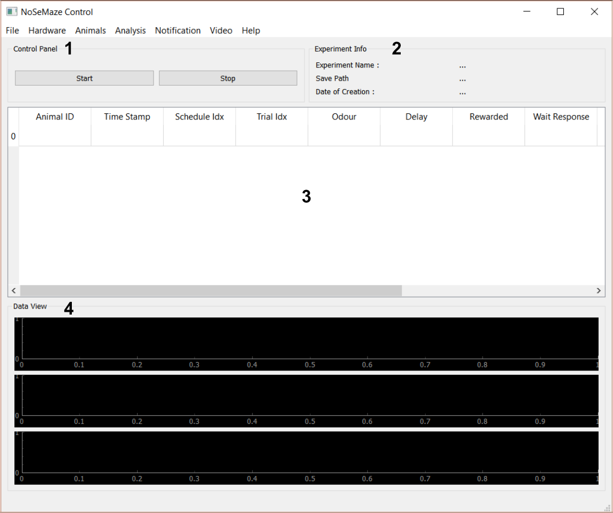
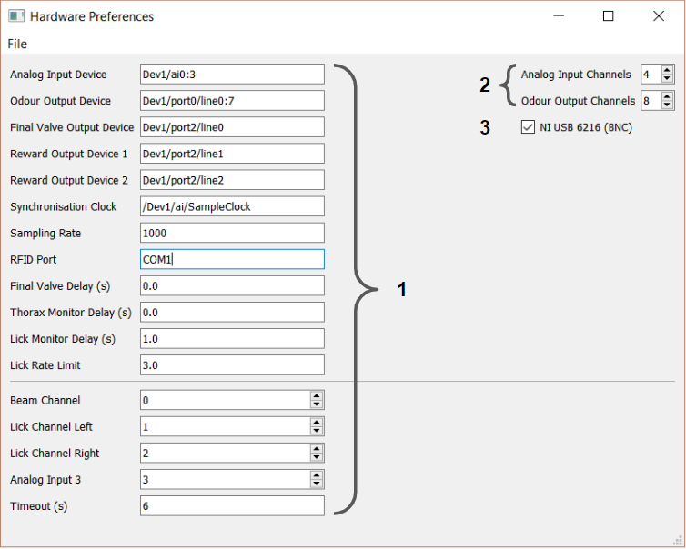
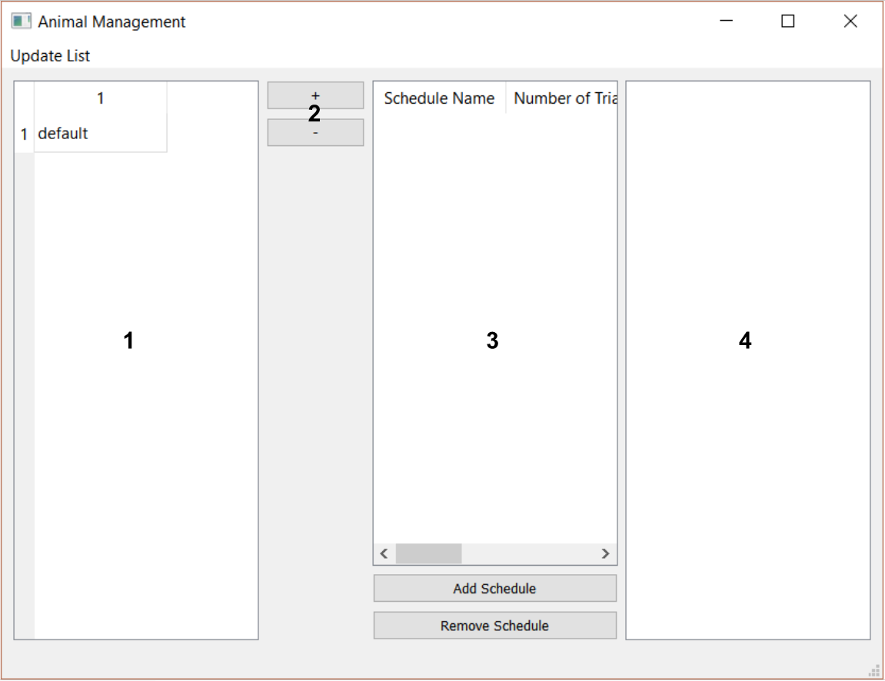
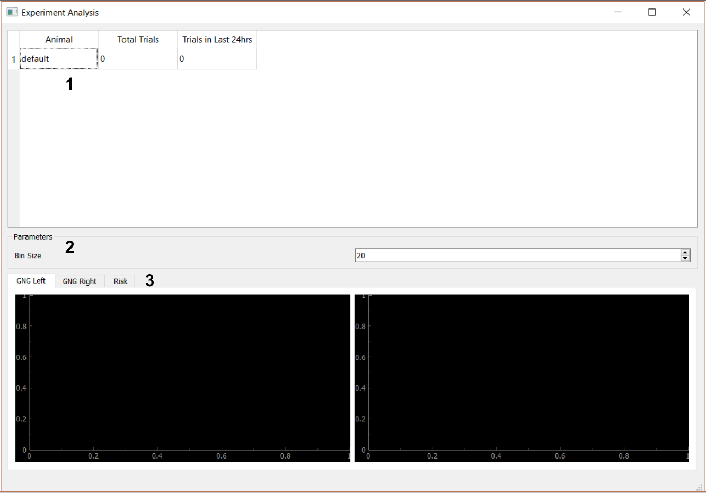
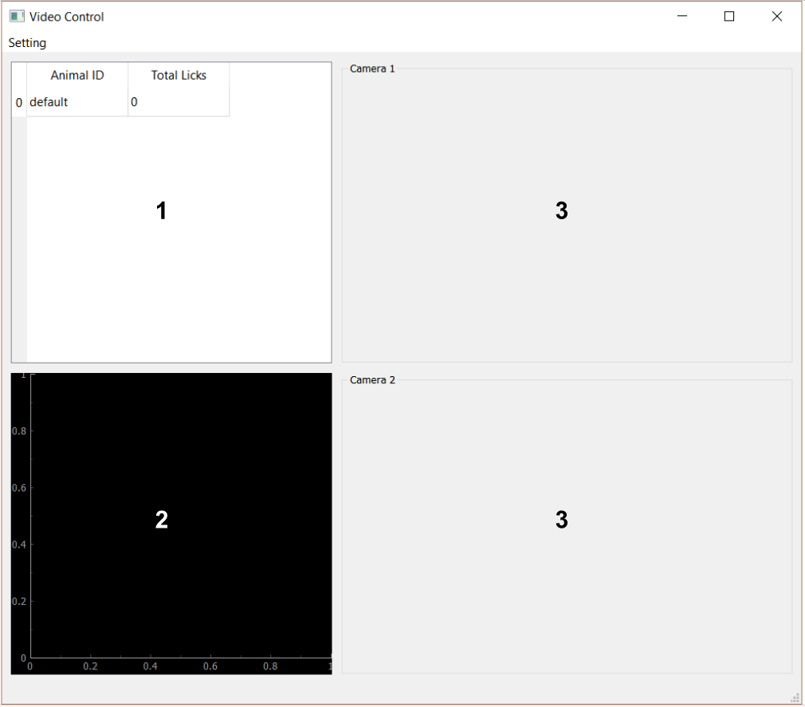
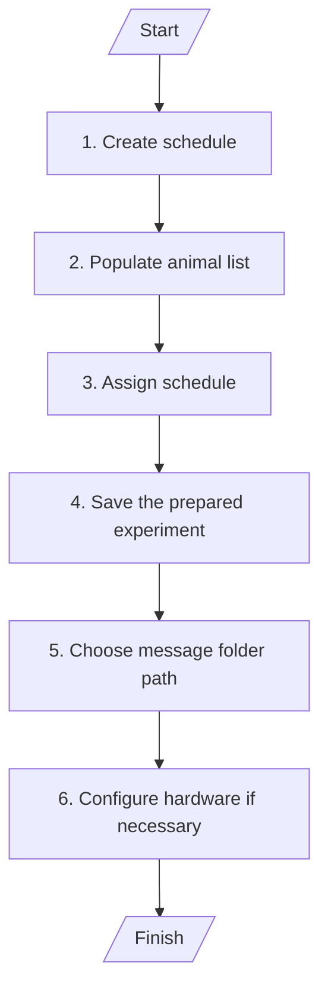
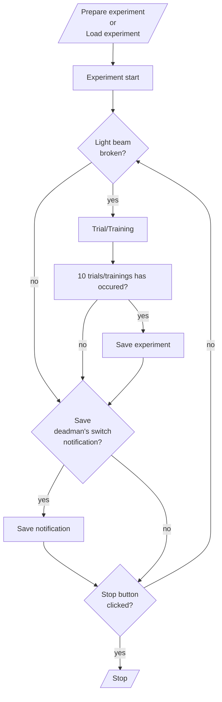
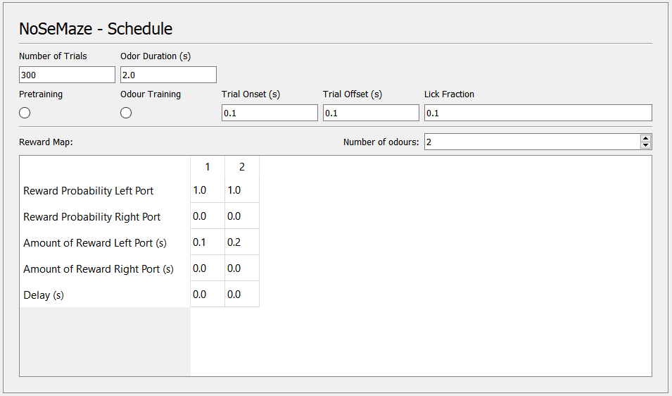
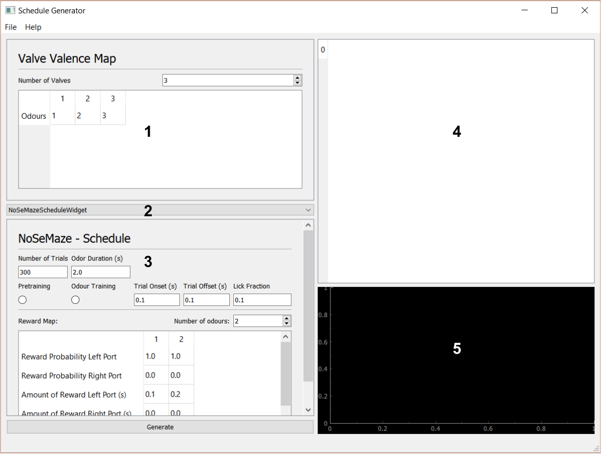

# User Guide

This documentation is meant to help user navigate the [_NoSeMazeControl_](#nosemazecontrol) UI and [_NoSeMazeSchedule_](#nosemazeschedule) UI and part of NoSemaze documentation.

## NoSeMazeControl

- [Introduction](#introduction-nsc)
- [Starting The UI](#starting-nsc)
- [Starting An Experiment](#starting-an-experiment)
- [UI Descriptions](#ui-nsc)
  - [Main Window](#nsc-main-window)
  - [Hardware Preference Window](#nsc-hardware-preference-window)
  - [Animals Window](#nsc-animals-window)
  - [Analysis Window](#nsc-analysis-window)
  - [Video Control Window](#nsc-video-control-window)
- [Experiment Flowchart](#experiment-flowchart)

### Introduction {#introduction-nsc}

The NoSeMazeControl serves as a central control for the user to:

- start and stop experiment session,
- save and load experiment,
- view some performance result,
- and also configure the hardware interface.

The trials/trainings executed during the experiment are determined by the schedules assigned to each animal.

### Starting The UI {#starting-nsc}

To start the UI, run [_main.py_](../../NoSeMazeControl/main.py) **from** the [_NoSeMazeControl_](../../NoSeMazeControl/) folder using python version 3.10 or above.

There are some possible ways to start the UI:

1. Starting the UI using python console
    1. Start a python console.
    2. Change the folder to NoSeMazeControl.
    3. Run main.py.
2. Starting the UI using python IDE
    1. Start a python IDE (e.g. VSCode, Spyder etc.).
    2. Open the NoSeMazeControl folder from the IDE as active directory/folder.
    3. Open main.py file.
    4. Run main.py file.

> :exclamation: **Important** :  
> The UI is dependent on niDAQmx as it communicates with the NI Board using niDAQmx library. Make sure to install it before starting the UI.

### Preparation Before Starting An Experiment {#preparation}

To start an experiment, there are several things that must be done first. If there is already a saved experiment (a file with _.nosemaze_ suffix), this section can be skipped (continue to **[Starting&nbsp;The&nbsp;Experiment](#starting-the-experiment)**).

1. **Create Schedule**
    Before starting the experiment, create the trials/training schedule necessary for the experiment using the NoSeMazeSchedule UI. For more details on how to create a schedule, see [NoSeMazeSchedule guide](#nosemazeschedule).
    </br>

2. **Populating animal List**
    The animal list must be populated with the RFID tag of the animals before starting the experiment. Populating animal list is done in the animal window.
    </br>
    > :exclamation: **Important** : There will be a _'default'_ animal available in the animal list. The _'default'_ animal will be used as a fallback dummy animal, if the rfid tag of an animal can not be read successfully.
    >
    > Assign a schedule also for the _'default'_ animal e.g. a simple water reward to ensure that the animal still get water as the lick port is designed as the only water source in the experiment setup. For more details about the setup, see the [setup guide](setupGuide.md).

    Step by step instruction:

    1. Click _animal list_ in _Animals_ menu in the menu bar to open the animal window.
    2. There will be a _'default'_ animal available in the animal list (Number 1 on [Fig. 3](#animals-window-nsc-animals-window)). To add an animal, click the _add_ button (plus button in number 2 on [Fig. 3](#animals-window-nsc-animals-window)). A new row will be added in the table.
    3. Double click the cell of the new row and write the RFID tag of the animal. After that click outside of the cell to exit cell editing.
    </br>
       > :memo: **Hint** : the written RFID will not yet be registered in the table before the cursor exit cell editing.
    4. Update the animal table by clicking _update list_ &rarr; _confirm_. Only saved animal RFID in the table can be assigned schedules.
    </br>

3. **Assigning Schedule**
    After populating the table, assign the schedule for each animal.

    Step by step instruction:

    1. Click on an animal in the animal list, then click _add schedule_ button. An open file dialogue window will be opened.
    2. Choose the schedule and open it. The schedule will be added to the animal and diplayed in the middle table viewer (number 3 of [Fig. 3](#animals-window-nsc-animals-window))
    </br>

4. **Saving the experiment session**
    After populating the animal list with the animals and its respectives schedules, save the experiment.

    Step by step instruction:

    1. Click _File_ in the menu.
    2. Then click _save experiment_. A file save dialogue window will be opened.
    3. Save the experiment.
    </br>

5. **Choose notification folder path**
    There will be messages that are saved in the notification folder path, e.g. a deadman's switch notification or software crash notification.

    > :memo: **Tip** : Choosing a cloud/synchronised folder as message folder will enable the user to monitor the experiment setup from remote workplace.

    Step by step instruction:
    1. To define the folder path, click _Notification_ &rarr; _Message Folder_. An file dialog window will be opened.
    2. Choose the folder which the messages should be written in.
    </br>

6. **Configure the hardware preferences** (optional)
    There might be some configuration that need to be done, such as, which analog input channel of the NI board used to detect licks. For more information, see **[Hardware&nbsp;Preference&nbsp;Window](#hardware-preference-window-nsc-hardware-preference-window)** in **[UI&nbsp;Description](#ui-descriptions-ui-nsc)**

### Starting The Experiment

After the aforementioned preparation is done, click the start button on the control panel (numbered 1 on [Fig. 1](#main-window-nsc-main-window)) to start the experiment. A deadman's switch notification will be saved; first at start, then at 8:00, at 17:00 and at 22:00. See **[Notification](#notification)** section for more information.

### Saving The Experiment

The experiment will be saved automatically after each 10 trials done by any animals. Saving the experiment can also be done manually by clicking **File**&nbsp;&rarr;&nbsp;**Save experiment** at any point of the experiment.

### Stopping The Experiment

To stop the experiment, click the **Stop** button in the **control panel** (numbered 1 on [Fig. 1](#main-window-nsc-main-window)).

### UI Descriptions {#ui-nsc}

#### Main Window {#nsc-main-window}


_**Fig. 1:** Main Window of NoSeMazeControl UI._

##### File {#mw}

Menu for saving and loading experiments.

##### Hardware

Menu for opening hardware preference window.

##### Animals

Menu for opeing animal list window.

##### Analysis

Menu for opening analysis window.

##### Notification

Menu for editing mailing list and message folder.

##### Video

Menu for opening video control window.

##### Help {#nsc}

Menu for opening user guide in a browser and for opening about window.

##### Control Panel (1)

Control panel for the exeperimentator to start or stop the experiment.

##### Experiment Info (2)

Information about the experiment which are the name of the experiment file, the path where the file is saved and the creation time of the file.

> :memo: **Hint:** The save path shown in the experiment info indicates also the path where intrisic data such as licks log should be saved. In case that the experiment file should be moved to another path or an experiment is using an old experiment file from another save path, the experiment should be saved first using "save experiment" action from "file" menu. It is recommended to save an experiment first before starting the experiment.

##### Results Table (3)

The table shows the results of the trials of every animals in animal list.

##### Odor Data and Licks Data/Analog Inputs (4)

The plots shows analog data of lick sensors and signals that is used to control the odor vents. This plot can be used to quickly view when the nozzle are licked compared to the odor presentation.

#### Hardware Preference Window {#nsc-hardware-preference-window}


_**Fig. 2:** Hardware Preference Window of NoSeMazeControl UI._

##### File {#hpw}

Menu for saving the hardware preferences.

##### Hardware Preferences Parameters [1]

The parameters used in the experiment.

1. Analog input device
    : NI device used for analog input. NI use a path-like description to describe the devices and the channels. Fig. 2 shows that the device name is "Dev1" and channels 0 to 3 from "ai" or analog input is used.

2. Odor output device
    : NI device used for controlling odor valves. Fig. 2 shows that the device name is "Dev1" and channels 0 to 7 from digital output in "port0" is used.

3. Final valve output device
    : NI device used for controlling final valve. Fig. 2 shows that channel 0 from digital output in "port2" from "Dev1" is used.

4. Reward output device 1
    : NI device used for controlling water valve 1. Fig. 2 shows that channel 1 from digital output in "port2" from "Dev1" is used.

5. Reward output device 1
    : NI device used for controlling water valve 1. Fig. 2 shows that channel 2 from digital output in "port2" from "Dev1" is used.

6. Synchronisation Clock
    : Source clock for digital outputs. Not used in static implementation in NI USB 6216 BNC.

7. Sampling rate
    : Input sampling rate in samples/seconds.

8. RFID port
    : Com port used for RFID decoder.

9. Final valve delay
    : Delay in second before final valve is switched. Should be set as 0.

10. Thorax monitor delay
    : Obsolete.

11. Lick monitor delay
    : Delay in second after odor presentation in which the analog input should be still recorded to check licks after odor presentation.

12. Lick rate limit
    : Threshold in number of licks to consider if a trial is responded or not. Fig. 2 shows that the threshold is set to 3 licks.

13. Beam channel
    : Channel number in analog input used as beam sensor input.

14. Lick channel left
    : Channel number in analog input used as lick sensor input considered from the left nozzle.

15. Lick channel right
    : Channel number in analog input used as lick sensor input consideed from the right nozzle.

16. Analog input 3
    : Currently not in used.

17. Timeout
    : Delay in seconds after a trial before a new trial begins if the trial beforehand was resulted in a miss (animal licked to not rewarded odor).

##### Number of Channels [2]

Number of channels used. This parameter will be used to prepare the data container.

##### NI USB 6216 Check Box [3]

Checkbox parameter which indicate that if NI USB 6216 BNC is used or not. In the current version, only NI USB 6216 is supported. The checkbox should be checked.

#### Animals Window {#nsc-animals-window}


_**Fig. 3:** Animals Window of NoSeMazeControl UI._

##### Update List

Menu to save the updated list. The list that has been made in animal list should alway be saved first before populating the animal list with schedule.

##### Animal List [1] {#aniw-animal-list}

The animal list in the experiment. 'default' animal must alway be available and populated with a schedule which the animal should follow to in case that the RFID from the animal could not be read properly.

##### Add and Remove Button [2]

Add button and remove button to add a row in the animal list or to remove selected rows in the animal list.

##### Schedule Table [3]

The table which shows the schedule assigned to an animal. The assigned schedules will be shown in the table if the animal in the animal list is selected.

##### Trial Parameter Table [4]

The table which shows the trials planned in the selected schedule. If a schedule in schedule table is selected, this table shows the trials planned in the schedule.

#### Analysis Window {#nsc-analysis-window}


_**Fig. 4:** Analysis Window of NoSeMazeControl UI._

##### Animal List [1] {#anaw-animal-list}

The animal list as inputed in animal list window.

##### Bin Size [2]

Bin size used to smooth the curve.

##### Performance Curve [3]

Performance curve of the animal. Two curves are shown, an individual performance curve and the group mean perfomance curve.

#### Video Control Window {#nsc-video-control-window}


_**Fig. 5:** Hardware Preference Window of NoSeMazeControl UI._

##### Setting

Menu to set up to two usb cameras used for video control. Coupled with remote desktop, an experimentator can controlled the experiment also via the video feed from this window.

1. Set cameras
    : Choose usb cameras to be used for camera 1 and camera 2.

2. Set resolution
    : Choose resolution to be used for camera 1 and camera 2.

3. Set adjustment
    : Set brightness adjustment to be used for camera 1 and camera 2.

##### Animal List [1] {#vcw-animal-list}

In this window, a group mean performance curve can also be viewed. Animal list show the list of animals as inputted in the animal list window.

##### Performance Curve [2]

Group mean performance curve of the animals.

##### Camera 1 Feedback [3]

Video feedback from camera 1.

##### Camera 2 Feedback [4]

Video feedback from camera 2.

### Experiment Process

This section provides flowcharts of processes in an experiment including the preparation of an experiment.

#### Preparation Flowchart



_**Fig. 6:** Preparation before the experiment._

#### Experiment Flowchart



_**Fig. 7:** Experiment flow from before starting an experiment to the end of an experiment._

### Known Issues {#nsc}

1. Closing the main window before stopping the experiment might cause the main window to hang for some time due to main window exterminating the experiment thread in a _"close"_ event.

## NoSeMazeSchedule

- [Introduction](#introduction-nss)
- [Starting The UI](#starting-nss)
- [Creating A Scheudule](#creating-a-schedule)
- [UI Descriptions](#nss-ui-descriptions)
  - [Main Window](#nss-main-window)

### Introduction {#introduction-nss}

The NoSeMazeSchedule serves as a tool to build schedules which are used in NoSeMazeControl. The schedules are made from a custom made widget. Developer can also build their custom widget e.g. with custom parameters for a custom trial as the widget build has a specific trial/training in mind. Please make sure to implement the trial/training also in NoSeMazeControl [ExperimentControl.py](../../NoSeMazeControl/Controllers/ExperimentControl.py) and [DAQ.py](../../NoSeMazeControl/daqface/DAQ.py).

### Starting The UI {#starting-nss}

To start the UI, run [scheduleMain.py](../../NoSeMazeSchedule/scheduleMain.py) from the [_NoSeMazeSchedule_](../../NoSeMazeSchedule/) folder using python version 3.10 or above.

There are some possible ways to start the UI:

1. Starting the UI using python console
    1. Start a python console.
    2. Change the folder to NoSeMazeSchedule.
    3. Run scheduleMain.py.
2. Starting the UI using python IDE
    1. Start a python IDE (e.g. VSCode, Spyder etc.).
    2. Open the NoSeMazeSchedule folder from the IDE as active directory/folder.
    3. Open scheduleMain.py file.
    4. Run scheduleMain.py file.

### Creating A Schedule

Steps to create a schedule:

1. Set number of valves in valve valence map. Valve valence map is numbered 1 in [Fig. 9](#main-window-nss-main-window)).

2. Choose which odor index will associated with which valve in valve valence map. To see more information about how to associate odour index with which valves, see **[Valve Valence Map](#valve-valence-map-1)** in **[UI Descriptions](#ui-descriptions-ui-nss)**.

3. Choose a schedule widget in schedule widget combo box (numbered 2 in [Fig. 9](#main-window-nss-main-window))

4. Set the schedule parameters in the schedule widget. For more information of the parameters, see **[Schedule&nbsp;Widget](#schedule-widget-3)**.

5. Click the **Generate** button. The generated schedule will be viewed on the **Trials Table** (numbered 4 in [Fig. 9](#main-window-nss-main-window)).

6. After checking if the schedule is correctly generated, save the schedule by clicking **File**&nbsp;&rarr;&nbsp;**Save**.

### NoSeMazeScheduleWidget



_**Fig. 8:** NoSeMazeScheduleWidget_

NoSeMazeScheduleWidget is a schedule widget which generates a GNG trials schedule for 2 lick ports. It can also be used to generate trials for 1 lick port as the reward given to left and right ports are defined separately, e.g. only rewarding left port or only rewarding right port for 1 port compatibility.

The parameters in this widget are:

1. Number of Trials
    : Number of trials should be generated in the schedule. Input is an integer number.

2. Odour Duration [s]
    : The duration that the odour should be presented in a trial. Input is a float number in seconds.

3. Pretraining
    : Schedule mode for pretraining. The animal will not be presented an odour and water will be given immediately through the lick port as soon as the light beam by the port is broken. To use this mode, check the radio checkbox.

    >For information about the lick port and the setup, see [setup guide](./setupGuide.md) or [hardware reference](../HardwareDocumentation/README.md).

4. Odour Training
    : Schedule mode for odour training. The animal will be presented an odour and will be given reward or a timeout according to the reward map. To use this mode, check the radio checkbox.

    >To uncheck both radio checkboxes reload the schedule widget by opening the schedule widget combo box (number 2 in [Fig. 9](#main-window-nss-main-window)) and selecting the widget again.
    :exclamation: Note that all parameters will also be reloaded to default value :exclamation:

5. Trial Onset [s]
    : The onset duration before all other trial processes in seconds. For most purposes, it can be left as default value, which is 0.1 second or 0 second.

6. Trial Offset [s]
    : The offset duration after all trial processes in seconds. For most purposes, it can be left as default value, which is 0.1 second or 0 second.

7. Lick Fraction
    : The value, above which the ratio of the duration the animal has licked to the duration the animal hasn't licked in a lick window is considered as responded. In the current implementation the trial, a trial will be considered responded when the animal has licked longer than `[the lick fraction] * [the duration of the lick window]` or the animal has licked more than twice.

    >E.g. Assumed that the lick window is 2 seconds and the lick fraction is 0.1, then the animal must licked longer than 0.2 seconds or licked the port more than twice, so that the trial is considered as 'responded'.

8. Number of Odours
    : The number of odours used in the trial. This defines the number of the odour index used in the schedule.

9. Reward Map
    : A table that maps which odour index is rewarded with which amount.
    The _**columns of the table**_ represent the odour index (column 1 is odour index 1, column 2 is odour index 2, etc.).
    The _**reward probability**_ defines the probability that the odour will be rewarded. Input is a floating number between 0 to 1.
    The _**amount of reward**_ defines the duration that the water valve will opened. Input is a floating number in seconds.
    The _**delay**_ defines the duration of a delay between an odour presentation to a lick window. Setting this to 0 means that the odour duration is the lick window. Else the lick window is equal to `[odour duration] - [delay]`. For most purposes, it can be left as 0.

#### Schedule Examples

Some examples of the parameters for some schedules are provided below.

##### [Example 1] GNG-trial with 2 odours and 1 reward output with odour index 1 is rewarded

- _**Outcome:**_
Trials for two odours with odour index 1 is certainly rewarded and odour index 2 is certainly not rewarded. Reward output is left port.
</br>

- _**Lick Sensor:**_
Lick sensor should be connected to the lick nozzle that is controlled by the water valve assigned as "left port" in the hardware preference. See [setup guide](./setupGuide.md) and [hardware preference parameters](#hardware-preferences-parameters-1) for more information.
</br>

- _**Number of odours parameters**_
Set the number of odours to 2.
</br>

- _**Reward map parameters**_

    _**Table 1**: Parameters for which reward from left port is given to animal if odour index 1 is presented._

    |                                 |   1   |   2   |
    | ------------------------------- | :---: | :---: |
    | Reward Probability Left Port    |  1.0  |  0.0  |
    | Reward Probability Right Port   |  0.0  |  0.0  |
    | Amount of Reward Left Port [s]  |  0.2  |  0.2  |
    | Amount of Reward Right Port [s] |  0.0  |  0.0  |
    | Delay                           |  0.0  |  0.0  |

>:memo: **Tip:**
Notice that although the amount of reward left port of odour index 2 is set to 0.2, no reward will be given because the reward probability on left port for odour is set to 0.

</br>

- _**Trial cases:**_

    ```mermaid
    graph LR
    A[Odour 1 is presented]
    B[Odour 2 is presented]
    A1[Animal licks]
    A2[Animal does not lick]
    A3[Animal licks]
    A4[Animal does not lick]
    R1[Reward]
    R2[No Reward]
    R3[Timeout]
    R4[No Reward]

    A --> A1 --> R1
    A --> A2 --> R2
    B --> A3 --> R3
    B --> A4 --> R4
    ```

    _**Fig. 8:** Trial cases of the schedule in [Example 1]._
</br>

- _**Pretraining and Odour Training Parameters**_
  - Checking the pretraining mode will generate a pretraining schedule and the parameters in reward map will not be used.
  - Checking the odour training mode will generate an odour training schedule and the reward map will be used. That is a trial with odour index 1 will present the odour assigned to the valve of odour index 1 then give the reward directly afterward. A trial with odour index 2 will then present the odour assigned to the valve of odour index 2 and not reward will be given.
</br>

##### [Example 2] GNG trial with 2 odours and 1 reward output with odour index 2 is rewarded

- _**Outcome:**_
Two odours with odour index 2 is certainly rewarded and odour index 1 is certainly not rewarded. Reward output is left port.
</br>

- _**Lick Sensor:**_
Lick sensor should be connected to the lick nozzle that is controlled by the water valve assigned as "left port" in the hardware preference. See [setup guide](./setupGuide.md) and [hardware preference parameters](#hardware-preferences-parameters-1) for more information.
</br>

- _**Number of odours parameters**_
Set the number of odours to 2.
</br>

- _**Reward map parameters**_

    _**Table 2**: Parameters for which reward from left port is given to animal if odour index 2 is presented, whereas odour index 1 is not rewarded._

    |                                 |   1   |   2   |
    | ------------------------------- | :---: | :---: |
    | Reward Probability Left Port    |  0.0  |  1.0  |
    | Reward Probability Right Port   |  0.0  |  0.0  |
    | Amount of Reward Left Port [s]  |  0.2  |  0.2  |
    | Amount of Reward Right Port [s] |  0.0  |  0.0  |
    | Delay                           |  0.0  |  0.0  |

>:memo: **Tip:**
This is basically the same parameter as the parameter from example 1 with the only different in the reward probability.

</br>

- _**Trial cases:**_

    ```mermaid
    graph LR
    A[Odour 1 is presented]
    B[Odour 2 is presented]
    A1[Animal licks]
    A2[Animal does not lick]
    A3[Animal licks]
    A4[Animal does not lick]
    R1[Timeout]
    R2[No Reward]
    R3[Reward]
    R4[No Reward]

    A --> A1 --> R1
    A --> A2 --> R2
    B --> A3 --> R3
    B --> A4 --> R4
    ```

    _**Fig. 9:** Trial cases of the schedule in [Example 1]._
</br>

- _**Pretraining and Odour Training Parameters**_
  - Checking the pretraining mode will generate a pretraining schedule and the parameters in reward map will not be used.
  - Checking the odour training mode will generate an odour training schedule and the reward map will be used. That is a trial with odour index 1 will present the odour assigned to the valve of odour index 1 and no reward will be given. A trial with odour index 2 will then present the odour assigned to the valve of odour index 2 and the reward will be given directly afterward.
</br>

##### [Example 3] GNG trial with 1 odour and 2 reward outputs

In this example, we will set the parameter of two schedules which will be used in a GNG trial with 1 odour and 2 reward outputs.

- _**Outcome:**_
One odour will be rewarded with different reward according to the animal.

> :memo: **Tip:**
> To achieve this outcome, two schedules will be used.
>
> - Schedule 1 is a schedule with the left port as reward output, which is attached e.g. with water.
>
> - Schedule 2 is a schedule with the right port as reward output with the right port attached to e.g. sugar water.
>
> Then we can assign the animal that should be rewarded with water with schedule 1 and the animal that should be rewarded with sugar water with schedule 2.

</br>

- _**Lick Sensor:**_
Lick sensor should be connected to both lick nozzle that is controlled by the water valve assigned as "left port" and "right port" in the hardware preference. See [setup guide](./setupGuide.md) and [hardware preference parameters](#hardware-preferences-parameters-1) for more information.
</br>

    > :exclamation: Make sure that both lick nozzle is connected together to a lick sensor :exclamation:

</br>

- _**Number of odours parameters**_
Set the number of odours to 1.
</br>

- _**Reward map parameters**_
    </br>_**Table 3**: Parameters for which the reward attached to left port should be given (schedule 1)._

    |                                 |   1   |
    | ------------------------------- | :---: |
    | Reward Probability Left Port    |  1.0  |
    | Reward Probability Right Port   |  0.0  |
    | Amount of Reward Left Port [s]  |  0.4  |
    | Amount of Reward Right Port [s] |  0.2  |
    | Delay                           |  0.0  |

    </br>_**Table 4**: Parameters for which the reward attached to right port should be given (schedule 2)._

    |                                 |   1   |
    | ------------------------------- | :---: |
    | Reward Probability Left Port    |  0.0  |
    | Reward Probability Right Port   |  1.0  |
    | Amount of Reward Left Port [s]  |  0.4  |
    | Amount of Reward Right Port [s] |  0.2  |
    | Delay                           |  0.0  |

</br>

- _**Trial cases:**_

    ```mermaid
    graph LR
    A[Odour 1 is presented]
    A1[Animal licks]
    A2[Animal does not lick]
    R1[Reward from left nozzle]
    R2[No Reward]

    A --> A1 --> R1
    A --> A2 --> R2
    ```

    _**Fig. 10:** Trial cases of the schedule 1 in [Example 3]._

    ```mermaid
    graph LR
    A[Odour 1 is presented]
    A1[Animal licks]
    A2[Animal does not lick]
    R1[Reward from right nozzle]
    R2[No Reward]

    A --> A1 --> R1
    A --> A2 --> R2
    ```

    _**Fig. 11:** Trial cases of the schedule 2 in [Example 3]._
</br>

- _**Pretraining and Odour Training Parameters**_
  - Checking the pretraining mode will generate a pretraining schedule and only the reward probability in reward map will be used to determine where reward should be given.
  - Checking the odour training mode will generate an odour training schedule and the reward map will be used. That is a trial with odour index 1 with left port as reward output will present the odour assigned to the valve of odour index 1 and directly give the reward from left port. A trial with odour index 2 will present the odour assigned to the valve of odour index 2 and the reward will be given directly afterward from right port.
</br>

##### [Example 4] Risk-reward trial with 1 odour and 2 reward outputs

This example could be used e.g. for testing risk-taking behaviour of the animal.

- _**Outcome:**_
One odour will be rewarded with different reward according to which lick nozzle is licked and with a probability defined in reward map.
</br>

- _**Number of odours parameters**_
Set the number of odours to 1.
</br>

- _**Reward map parameters**_
    </br>_**Table 5**: Parameters for which the reward is given with a probability less than zero._

    |                                 |   1   |
    | ------------------------------- | :---: |
    | Reward Probability Left Port    |  0.7  |
    | Reward Probability Right Port   |  0.5  |
    | Amount of Reward Left Port [s]  |  0.1  |
    | Amount of Reward Right Port [s] |  0.8  |
    | Delay                           |  0.0  |

    > :memo: **Tip:**
    In the current version, the animal must only licked one nozzle

### UI Descriptions {#ui-nss}

#### Main Window {#nss-main-window}



_**Fig. 9:** Main window of schedule generator UI._

##### File {#nss}

Menu for saving the generated schedule.

##### Help {#nss}

Menu for opening user guide in a browser and for opening about window.

##### Valve Valence Map [1]

The map of the odor index assigned to which valve index. Valve index is indicated by the column number and the odor index is indicated by the cell value in the table.

##### Schedule Widget Combo Box [2]

A drop down list of available schedule generator. Schedule generator is the schedule widget classes defined in ScheduleWidgets.py.

##### Schedule Widget [3]

A widget to define parameters in generating a schedule.

##### Generate Button

The button to generate the schedule.

##### Trials Table [4]

The generated schedule is shown in the table. The table shows all the trials is planned in the schedule.

##### Odour Port Data [5]

A graph to indicate how the odor valves will be controlled.

### Known Issues {#nss}

1. Though many inputs are checked before further processing, not all inputs are checked against false input or out-of-range input, which might caused the software to crash.
