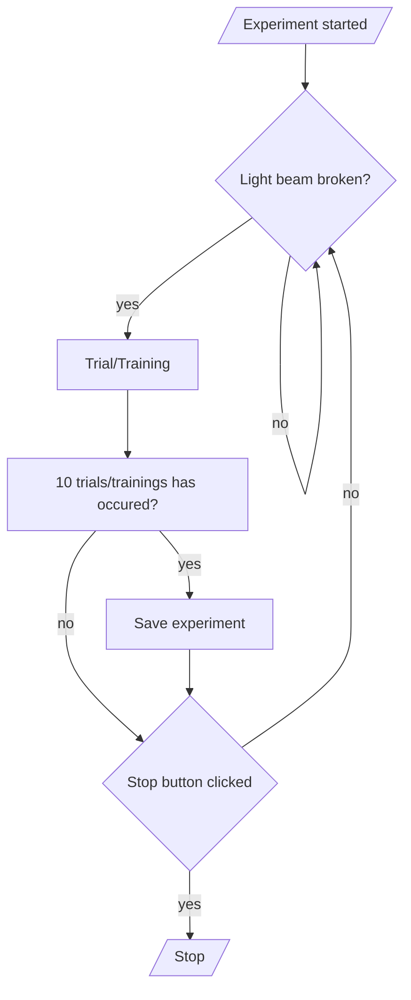

# User Guide

This documentation is meant to help user navigate the [*NoSeMazeControl*](#nosemazecontrol) UI and [*NoSeMazeSchedule*](#nosemazeschedule) UI.

## NoSeMazeControl

- [Introduction](#introduction-nsc)
- [Starting The UI](#starting-nsc)
- [Starting An Experiment](#starting-an-experiment)
- [UI Descriptions](#ui-nsc)
  - [Main Window](#nsc-main-window)
  - [Hardware Preference Window](#nsc-hardware-preference-window)
  - [Animals Window](#nsc-animals-window)
  - [Analysis Window](#nsc-analysis-window)
  - [Video Control Window](#nsc-video-control-window)
- [Experiment Flowchart](#experiment-flowchart)

### Introduction {#introduction-nsc}

The NoSeMazeControl serves as a central control for the user to:

- start and stop experiment session,
- save and load experiment,
- view some performance result
- and also configure the hardware interface.

### Starting The UI {#starting-nsc}

To start the UI, run *main.py* from the *NoSeMazeControl* folder using python version 3.10 or above.

> :exclamation: **Important** :  
> The UI is dependent on niDAQmx as it communicates with the NI Board using niDAQmx library. Make sure to install it before starting the UI.

### Starting An Experiment

To start an experiment, there are several things that should be done first.

1. **Populating Animal Table**

    Before starting the experiment, the animal table must be populated first. Click *animal* in the menu bar to open the table.

2. **Saving the experiment session**

    After populating the animal table with the animals and its respectives schedules, save the experiment. Click *File* in the menu and save the experiment.

3. **Configure the hardware preferences** (optional)

    There might be some configuration that need to be done, such as, which analog input channel of the NI board used to detect licks.

### UI Descriptions {#ui-nsc}

#### Main Window {#nsc-main-window}

**Fig.1**

#### Hardware Preference Window {#nsc-hardware-preference-window}

#### Animals Window {#nsc-animals-window}

#### Analysis Window {#nsc-analysis-window}

#### Video Control Window {#nsc-video-control-window}

### Experiment Flowchart

Description of experiment flow goes here.

## NoSeMazeSchedule

- [Introduction](#introduction-nss)
- [Starting The UI](#starting-nss)
- [Creating A Scheudule](#creating-a-schedule)
- [UI Descriptions](#nss-ui-descriptions)
  - [Main Window](#nss-main-window)

### Introduction {#introduction-nss}

### Starting The UI {#starting-nss}

### Creating A Schedule

### UI Descriptions {#nss-ui-descriptions}

#### Main Window {#nss-main-window}
