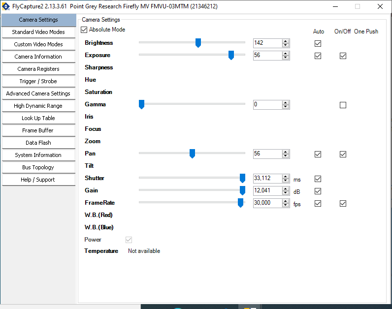
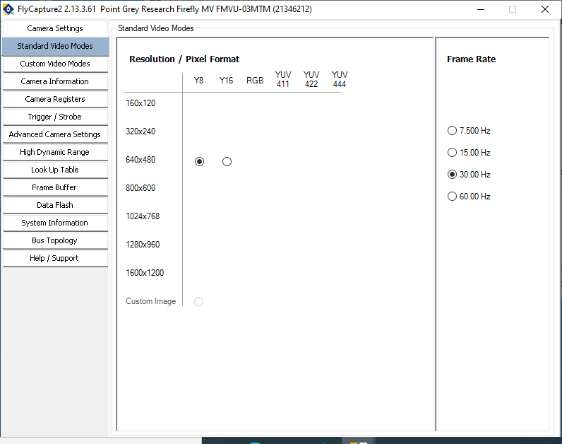
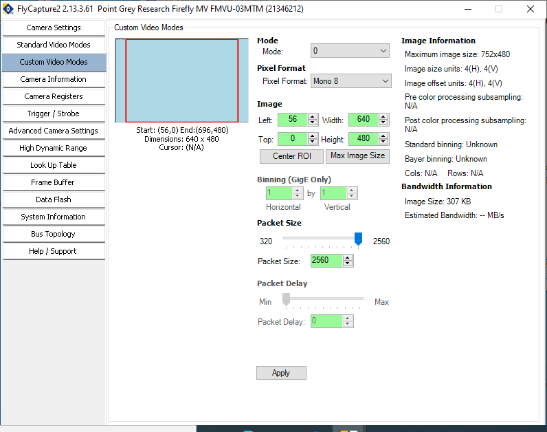
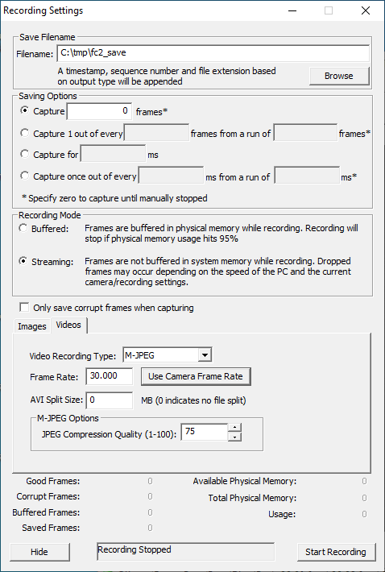

# Hardware Reference

This reference contains informations regarding the hardware or subsystem used in NoSeMaze setup and is part of NoSeMaze documentation. For instruction or help on building the setup, refer to the [setup guide](../Guides/setupGuide.md).

> :exclamation: An step file of NoSeMaze setup is provided in this folder.

Following are the subsystems with each hardware used in the setup.

## Automatic Olfactometer System

### 1. Computer

The NoSeMaze was developed in a WindowsNT operating system.

### 2. National Instrument Data Acquisition Board

The board used to control the setup and acquire data is NI-USB 6216 BNC.

> :memo: **Memo** : As the actual version, the software was developed specific to NI-USB 6216 without portability to other platform.

### 3. Olfactometer

A set of three-way valves which connected via flexible tube.

### 4. Lick Port

A box designed to deliver water. Water is delivered via a nozzle which is connected to a water container and controlled using a valve.

### 5. RFID Antenna

RFID antenna used are RFID antenna from DorsetID. For more information of which antenna is used, please contact Wolfgang Kelsch (wolfgang.kelsch@zi-mannheim.de).

### 6. RFID Decoder

RFID decoder user are RFID decoder from DorsetID. For more information of which decoder is used, please contact Wolfgang Kelsch (wolfgang.kelsch@zi-mannheim.de).

## Tube Test System

### 1. RFID Antennae

Four antenna are used to detect animal activities by two tubes. Antenna used are from DorsetID. For which antenna is used, please contact Wolfgang Kelsch (wolfgang.kelsch@zi-mannheim.de).

### 2. RFID Decoders

Four decoder are connected using RS485 protocoll in a chain. The first decoder in the chain is connected via a RS485-to-USB adapter to the computer.

## Environment Sensor Module

Enviorment sensor module is provided by Fraunhofer-Institute for Manufacturing Engineering and Automation - Clinical Health Technologies in Mannheim. For more information, please contact Jan Ringkamp (jan.ringkamp@ipa.fraunhofer.de).

## Video Cameras for Analysis with Video Tracking

FLIR USB2.0 camera are used for video tracking. Video are recorded using FlyCap2Viewer from Teledyne FLIR.

_**Fig. 1** : camera options shown after opening FlyCap2Viewer_

Following are the camera settings and the recording settings used to record the video (frame rate = 30 fps)

_**Fig. 2**: Camera Settings_

_**Fig. 3**: Standard Video Modes_

_**Fig. 4**: Custom Video Modes_

_**Fig. 5**: Recording Settings_
