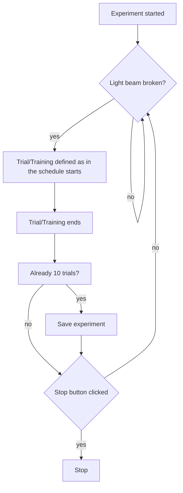

# User Guide

This documentation is meant to help user navigate the *NoSeMaze Controller* UI and *NoSeMaze Schedule* UI.

## NoSeMaze Controller

### Introduction

The NoSeMaze Controller serves as a central control for the user to start and stop experiment session and save it.

#### Experiment Flow

Description of experiment flow goes here.

### Starting the UI

To start the UI, run *main.py* from the *NoSeMaze Controller* folder using python version 3.10 or above.

> **Important** :  
> The UI is dependent on niDAQmx as it communicates with the NI Board using niDAQmx library. Make sure to install it before starting the UI.

### Starting an Experiment

To start an experiment, there are several things that should be done first.

1. **Populating Animal Table**

    Before starting the experiment, the animal table must be populated first. Click *animal* in the menu bar to open the table.
     

    
     

2. **Saving the experiment session**

    After populating the animal table with the animals and its respectives schedules, save the experiment. Click *File* in the menu and save the experiment.
     

    
     

3. **Configure the hardware preferences** (optional)

    There might be some configuration that need to be done, such as which analog input channel of the NI board used to detect  
